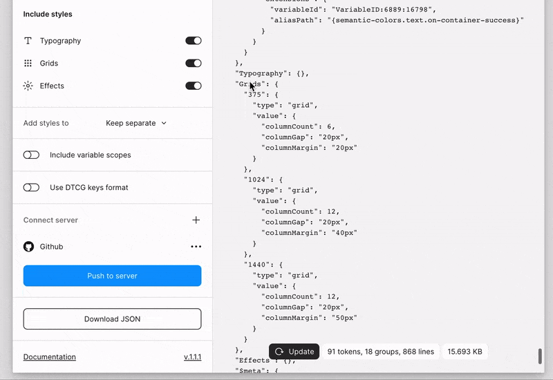
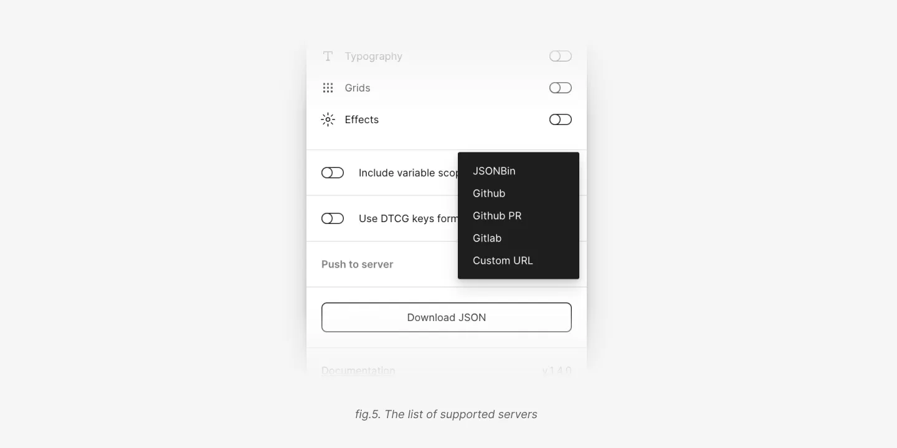
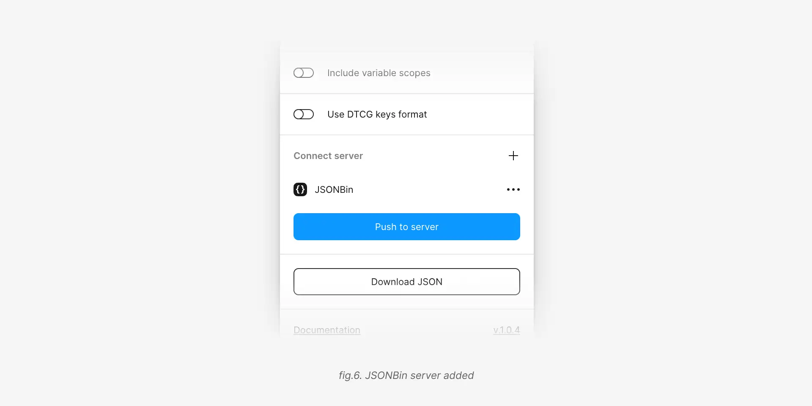
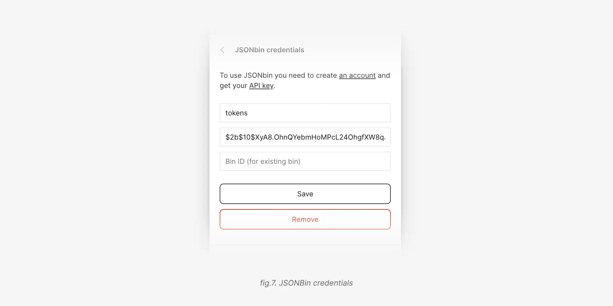
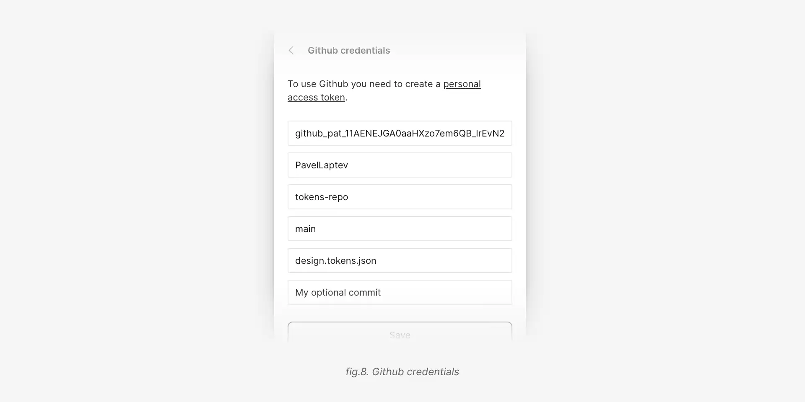
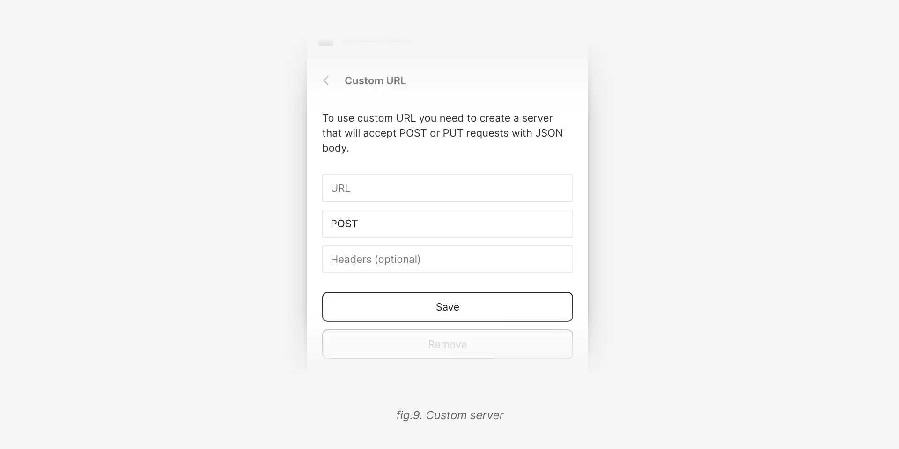
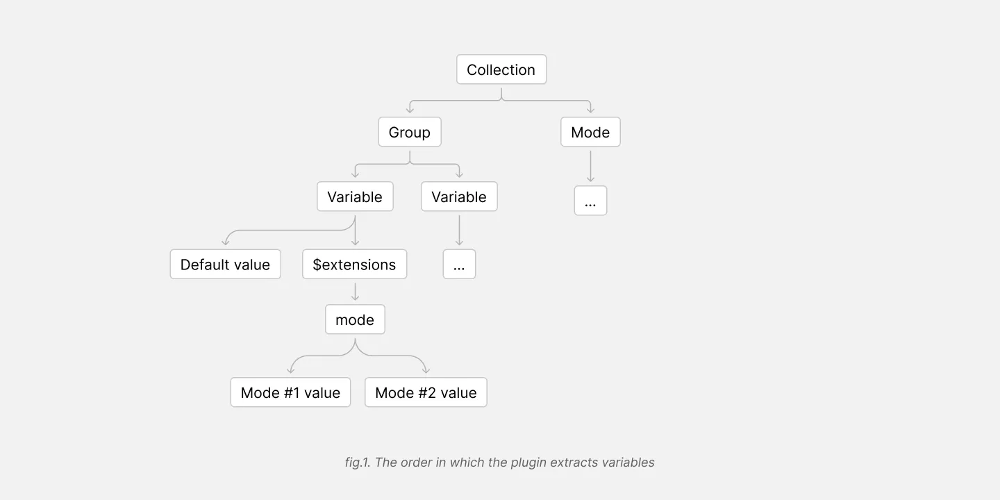

# TokensBrücke — Figma plugin

<a href="https://www.figma.com/community/plugin/1254538877056388290" target="_blank">

</a>

## What is this plugin for?

The plugin converts Figma variables into design-tokens JSON that are compatible with the latest [Design Tokens specification](https://design-tokens.github.io/community-group/format/).

---

## Table of contents

- [TokensBrücke — Figma plugin](#tokensbrücke--figma-plugin)
  - [What is this plugin for?](#what-is-this-plugin-for)
  - [Table of contents](#table-of-contents)
  - [How to use](#how-to-use)
  - [General settings](#general-settings)
    - [Color mode](#color-mode)
    - [Include styles](#include-styles)
    - [Add styles to](#add-styles-to)
    - [Include variable scopes](#include-variable-scopes)
    - [Use DTCG keys format](#use-dtcg-keys-format)
  - [Connect server](#connect-server)
    - [JSONBin](#jsonbin)
    - [GitHub](#github)
    - [Custom server](#custom-server)
  - [Show output](#show-output)
  - [Config autosaving](#config-autosaving)
  - [Styles support](#styles-support)
    - [Typography](#typography)
    - [Grids](#grids)
    - [Shadows](#shadows)
    - [Blur](#blur)
    - [Why there is no support for color styles?](#why-there-is-no-support-for-color-styles)
    - [Gradients support 🚧](#gradients-support-)
  - [Tokens structuring](#tokens-structuring)
  - [Aliases handling](#aliases-handling)
    - [Handle modes](#handle-modes)
  - [Variables types conversion](#variables-types-conversion)
  - [Design tokens types](#design-tokens-types)
  - [Style Dictionary support](#style-dictionary-support)
  - [Contribution 🚧](#contribution-)
  - [Feedback](#feedback)
  - [Changelog](#changelog)

---

## How to use

1. Install the plugin from the [Figma Community](https://www.figma.com/community/plugin/1254538877056388290).
2. Make sure you have variables in your Figma file.
3. Run the plugin.
4. Adjust the settings.
5. Then you can download the JSON file or push it to on of the [supported services](#link).

---

## General settings

### Color mode

Allows you to choose the color mode for the generated JSON. Default value is `HEX`. The plugin supports the following color modes:

- `HEX` — HEX color format. Could be converted into `HEXA` if the color has an alpha channel.
- `RGBA CSS` — RGBA color format in CSS syntax, e.g. `rgba(0, 0, 0, 0.5)`.
- `RGBA Object` — RGBA color format in object syntax, e.g. `{ r: 0, g: 0, b: 0, a: 0.5 }`.
- `HSLA CSS` — HSLA color format in CSS syntax, e.g. `hsla(0, 0%, 0%, 0.5)`.
- `HSLA Object` — HSLA color format in object syntax, e.g. `{ h: 0, s: 0, l: 0, a: 0.5 }`.

### Include styles

Allows you to include styles into the generated JSON. See more about styles support in the [Styles support](#styles-support) section.

There is an option to rename each style's group and give it a custom name for better organization.



### Add styles to

Allows you to choose where to put styles in the generated JSON. By default, the selected value is `Keep separate`. In this case styles will be added into the root of the JSON and will be treated as collections. There is also an option to add styles into the corresponding collection (fig.4).


### Include variable scopes

Each Figma variable has a [scope property](https://www.figma.com/plugin-docs/api/VariableScope). The plugin allows you to include scopes into the generated JSON. It will be included as an array of strings without any transformations.

```json
{
  "button": {
    "background": {
      "type": "color",
      "value": "#000000",
      "scopes": ["ALL_SCOPES"]
    }
  }
}
```

### Use DTCG keys format

Is `off` by default. Currently many design tokens tools doesn't support [DTCG keys format](https://design-tokens.github.io/community-group/format/#character-restrictions). All DTCG keys are prefixed with `$` symbol.

```json
// Without DTCG keys format
{
  "button": {
    "background": {
      "type": "color",
      "value": "#000000"
    }
  }
}

// With DTCG keys format
{
  "button": {
    "background": {
      "$type": "color",
      "$value": "#000000",
    }
  }
}
```

---

## Connect server

With this feature you can connect a server and push the generated JSON directly to it. At the moment the plugin supports [JSONBin](https://jsonbin.io), [GitHub](https://github.com) and custom servers.



If you connected multiple servers, the plugin will try to push the tokens to all of them one by one.
In ordere to test if your credentials are valid you can make a test request by clicking the `Push to server` button (fig.6).



### [JSONBin](https://jsonbin.io)

1. Open [JSONBin](https://jsonbin.io) and create an account.
2. Generate a [new API key](https://jsonbin.io/api-reference/access-keys/create).
3. If you want to use an existing bin, copy its ID. Otherwise just leave the ID field empty in the plugin settings.
4. Add a name for the bin.



### [GitHub](https://github.com)

1. You need to create a [personal access token](https://docs.github.com/en/github/authenticating-to-github/creating-a-personal-access-token) with `repo` scope.
2. In the plugin settings paste the token into the `Token` field.
3. Add an owner name, repository name and a branch name.
4. In the file name field you can specify a path to the file. If the file doesn't exist, it will be created. If the file exists, it will be overwritten.
5. You can also specify a commit message.



### Custom server

There is a possibilty to connect a custom server. In order to do that you need to specify a URL, a method (by default it's `POST`) and headers.



---

## Show output

If you want to see the generated JSON, you can enable the `Show output` option. The plugin will show the JSON in the sidebar. The output doesn't update automatically, in order to optimize the performance. So, if you want to see the updated JSON, you need to click the `Update` button.


---

## Config autosaving

The plugin saves the config automatically. So, you don't need to set it up every time you run the plugin.

---

## Styles support

The plugin can support some styles and effects too. Until Figma will support all the styles and effects, the plugin will convert them into the corresponding design tokens types. But it's not a backward compatibility, it's a temporary solution until Figma will support all the styles and effects as variables.

Supported styles:

- Typography
- Grids
- Shadows (including `inset` shadows)
- Blur (including `background` and `layer` blur)

### Typography

```json
"extralight": {
  "type": "typography",
  "value": {
    "fontFamily": "Inter",
    "fontWeight": 400,
    "fontSize": "18px",
    "lineHeight": "28px",
    "letterSpacing": "0%"
  },
  "description": "",
  "extensions": {
    "styleId": "S:0ffe98ad785a13839980113831d5fbaf21724594,"
  }
}
```

### Grids

In Figma you can add as many grids in the style as you want. But the plugin will take only first two grids and treat the first one as `column` grid and the second one as `row` grid.

```json
// Column grid
"1024": {
  "type": "grid",
  "value": {
    "columnCount": 12,
    "columnGap": "20px",
    "columnMargin": "40px"
  }
}

// Row grid
"1024": {
  "type": "grid",
  "value": {
    "rowCount": 12,
    "rowGap": "20px",
    "rowMargin": "40px"
  }
}

// Both grids
"1024": {
  "type": "grid",
  "value": {
    "columnCount": 12,
    "columnGap": "20px",
    "columnMargin": "40px",
    "rowCount": 12,
    "rowGap": "20px",
    "rowMargin": "40px"
  }
}
```

### Shadows

The plugin supports `drop-shadow` and `inner-shadow` effects. If the effect is `inner-shadow`, the plugin will set the `inset` property to `true`.

```json
"xl": {
  "type": "shadow",
  "value": {
    "inset": false,
    "color": "#0000000a",
    "offsetX": "0px",
    "offsetY": "10px",
    "blur": "10px",
    "spread": "-5px"
  }
}
```

### Blur

The plugin supports `background` and `layer` blur effects. In order to distinguish between them, the plugin adds the `role` property to the generated JSON.

```json
// Background blur
"sm": {
  "type": "blur",
  "value": {
    "role": "background",
    "blur": "4px"
  }
}

// Layer blur
"md": {
  "type": "blur",
  "value": {
    "role": "layer",
    "blur": "12px"
  }
}
```

### Why there is no support for color styles?

Despite the fact that color styles could be important for backward compatibility — the main goal of the plugin is to convert Figma variables into design tokens. Since Figma already has a support for color in variables, there is no need to convert also color styles into design tokens.

### Gradients support 🚧

Support for gradients is comming with the next major release.

---

## Tokens structuring

Plugin first takes the collection name, then mode name and then variable name (fig.1).



For example, if you have a collection named `Colors`, mode named `Light` and variable named `Primary`, the plugin will generate the following JSON:

```json
{
  "colors": {
    "light": {
      "primary": {
        "10": {
          "type": "color",
          "value": "#000000"
        }
      }
    }
  }
}
```


Figma automatically merges groups and their names into a single name, e.g. `Base/Primary/10` (fig.2). In this case, the plugin will generate the following JSON:

```json
{
  "base": {
    "primary": {
      "10": {
        "type": "color",
        "value": "#000000"
      }
    }
  }
}
```

## Aliases handling

All aliases are converted into the alias string format from the [Design Tokens specification](https://design-tokens.github.io/community-group/format/#aliases-references).

```json
{
  "button": {
    "background": {
      "type": "color",
      "value": "{colors.light.primary.10}"
    }
  }
}
```

---

### Handle modes

If there is only one mode — the plugin wouldn't include it in a generated JSON.

---

## Variables types conversion

Unlike design tokens, Figma variables now [support only 4 types](https://www.figma.com/plugin-docs/api/VariableResolvedDataType) — `COLOR`, `BOOLEAN`, `FLOAT` and `STRING`. So, the plugin converts them into the corresponding types from the [Design Tokens specification](https://design-tokens.github.io/community-group/format/#types).

| Figma type | Design Tokens type                                                                  |
| ---------- | ----------------------------------------------------------------------------------- |
| COLOR      | [color](https://design-tokens.github.io/community-group/format/#color)              |
| BOOLEAN    | _boolean_ \*                                                                        |
| FLOAT      | [dimension](https://design-tokens.github.io/community-group/format/#dimension) \*\* |
| STRING     | _string_ \*                                                                         |

\* native JSON types. The specification doesn't restrict the type of the value, so it could be any JSON type. Also see [this issue](https://github.com/design-tokens/community-group/issues/120#issuecomment-1279527414).

\*\* currently figma supports only the `FLOAT` type for dimensions, that could be used only for `px` values. So, the plugin converts `FLOAT` values into `dimension` type with `px` unit.

---

## Design tokens types

In order to validate types, the plugin uses the [Design Tokens types](https://github.com/PavelLaptev/tokens-bruecke/blob/main/token-types.d.ts).

---

## Style Dictionary support

There is a set of utils for [Style Dictionary](https://github.com/tokens-bruecke/sd-utils).

---

## Contribution 🚧

Comming soon.

---

## Feedback

If you have any questions or suggestions, feel free to [create an issue](https://github.com/tokens-bruecke/figma-plugin/issues)

---

## Changelog

**1.0.0**

- Initial release

**1.0.1**

- Fixed Aliases handling. Removed `mode` from the alias string if there is only one mode in the collection.

**1.0.2**

- Fixed RGBA to HEXA conversion
- Added color styles support
- Added basic support for linear and radial gradients

**1.0.3**

- HEX color fixed
- Alias variables fixed

**1.0.4**

- Fix scopes conversion
- `$meta` info adding order fixed

**1.0.5**

- Allowed to use plugin in files without variables

**1.0.6**

- WIP [Reference tokens auto-referencing themselves in the exported JSON](https://github.com/PavelLaptev/tokens-bruecke/issues/1)

**1.0.7**

- Code cleanup

**1.0.8**

- Fix for [Reference tokens auto-referencing themselves in the exported JSON](https://github.com/PavelLaptev/tokens-bruecke/issues/1)

**1.0.9**

- Fixed `line-height` value conversion. It wasn't rounded to the nearest integer.

**1.1.0**

- `Update` button animation added
- added token types as a separate package

**1.1.1**

- Updated errors handling for GitHub server
