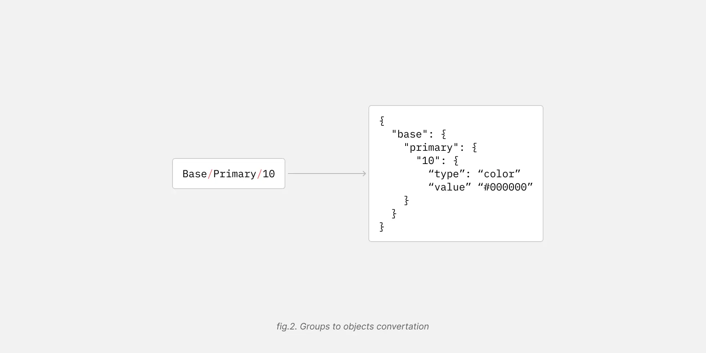

# TokensBrücke — Figma plugin

<a>

</a>

## What is this plugin for?

The plugin converts Figma variables into design-tokens JSON that are compatible with the latest [Design Tokens specification](https://design-tokens.github.io/community-group/format/).

## Handling styles

The plugin can support some styles and effects too. Until Figma will support all the styles and effects, the plugin will convert them into the corresponding design tokens types. But it's not a backward compatibility, it's a temporary solution until Figma will support all the styles and effects as variables.

Supported styles:

- Typography
- Grids
- Shadows (including `inset` shadows)
- Blur (including `background` and `layer` blur)

### Why there is no support for color styles?

Despite the fact that color styles could be important for backward compatibility — the main goal of the plugin is to convert Figma variables into design tokens. Since Figma already has a support for color in variables, there is no need to convert also color styles into design tokens.

### Gradients support

Support for gradients is comming with the next major release.

---

## Tokens structuring

Plugin first takes the collection name, then mode name and then variable name (fig.1).


For example, if you have a collection named `Colors`, mode named `Light` and variable named `Primary`, the plugin will generate the following JSON:

```json
{
  "colors": {
    "light": {
      "primary": {
        "10": {
          "type": "color",
          "value": "#000000"
        }
      }
    }
  }
}
```



Figma automatically merge groups and their names into a single name, e.g. `Base/Primary/10` (fig.2). In this case, the plugin will generate the following JSON:

```json
{
  "base": {
    "primary": {
      "10": {
        "type": "color",
        "value": "#000000"
      }
    }
  }
}
```

## Aliases handling

All aliases are converted into the alias string format from the [Design Tokens specification](https://design-tokens.github.io/community-group/format/#aliases-references).

```json
{
  "button": {
    "background": {
      "type": "color",
      "value": "{colors.light.primary.10}"
    }
  }
}
```

---

## Variables types conversion

Unlike design tokens, Figma variables now support only 4 types: `COLOR`, `BOOLEAN`, `FLOAT`, `STRING`. So, the plugin converts them into the corresponding types from the [Design Tokens specification](https://design-tokens.github.io/community-group/format/#types).

| Figma type | Design Tokens type                                                                  |
| ---------- | ----------------------------------------------------------------------------------- |
| COLOR      | [color](https://design-tokens.github.io/community-group/format/#color)              |
| BOOLEAN    | _boolean_ \*                                                                        |
| FLOAT      | [dimension](https://design-tokens.github.io/community-group/format/#dimension) \*\* |
| STRING     | _string_ \*                                                                         |

\* native JSON types. The specification doesn't restrict the type of the value, so it could be any JSON type. Also see [this issue](https://github.com/design-tokens/community-group/issues/120#issuecomment-1279527414).

\*\* currently figma supports only the `FLOAT` type for dimensions, that could be used only for `px` values. So, the plugin converts `FLOAT` values into `dimension` type with `px` unit.

---

## Design Tokens types

In order to validate types, the plugin uses the [Design Tokens types](https://github.com/PavelLaptev/tokens-bruecke/blob/main/token-types.d.ts).

---

## How to use

---

## Settings

### Names transform

Allows you to transform

## Scope

Scope types https://www.figma.com/plugin-docs/api/VariableScope

## Styles

## Effects

### Shadows

Currently the specification supports only `drop-shadow` effect. But in order to support `inset` shadows, the `inset` property will be added to the `shadow` object.

### WHY THERE IS NO SUPPORT FOR COLLORS?

Because.

### GRADIENTS

Currect design tokens implementation doesnt' have a support for non-linear gradients, also it doesnt support the `angle` property.

iisue: [https://github.com/design-tokens/community-group/issues/101](https://github.com/design-tokens/community-group/issues/101)

## TODO:

- Describe restrictions
- Show current JSON implementation

## GRIDS

If you have multiple grid layouts, the plugin will take only first two and treat the first one as `column` grid and the second one as `row` grid.

Link to the grid token repo: here

# USE DTCG key format ($)

Read more about DTCG [characters restrictions](https://design-tokens.github.io/community-group/format/#character-restrictions)

---

## CONTRIBUTION

Comming soon.

---

## CHANGELOG

### 1.0.0

- Initial release

### 1.0.1

- Fixed Aliases handling. Removed `mode` from the alias string if there is only one mode in the collection.

### 1.0.2

- Fixed RGBA to HEXA conversion
- Added color styles support
- Added basic support for linear and radial gradients

### 1.0.3

- HEX color fixed
- Alias variables fixed
